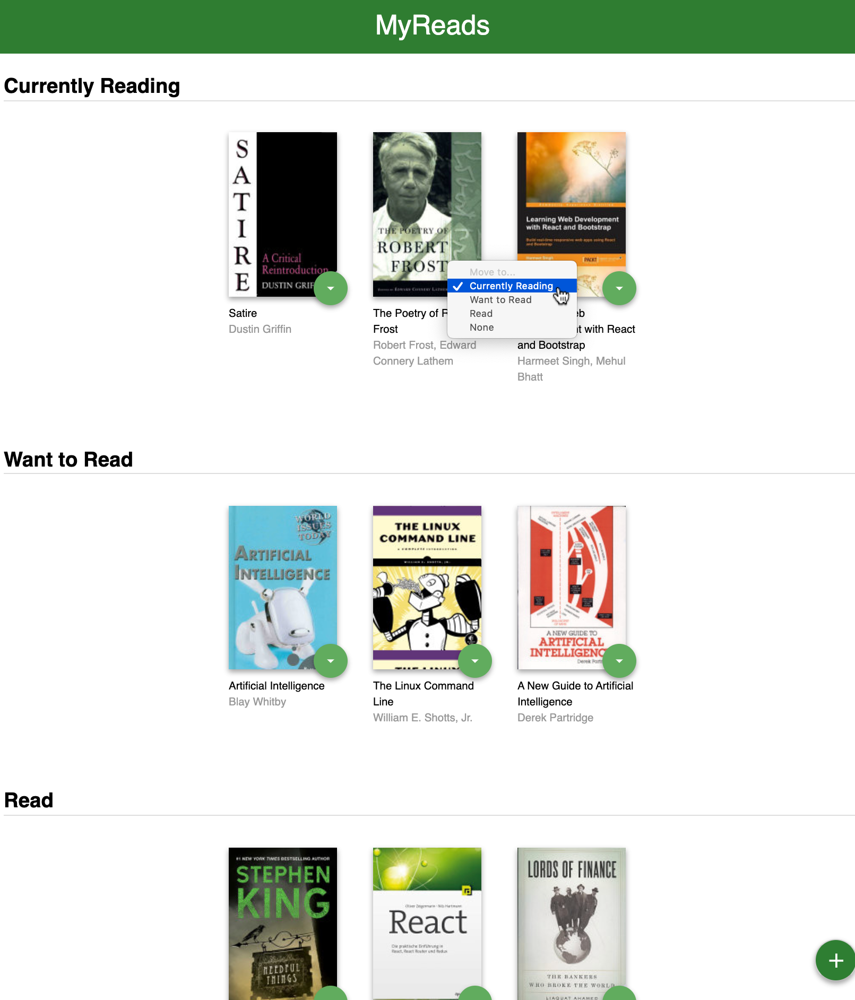

# MyReads

MyReads lets the user search for books[\*](#footnote01)
and organize them onto one of three "shelves":

1. Currently Reading
2. Want to Read
3. Read

<a name="footnote01">\*</a>This sample app only searches books in the udacity books api, [https://reactnd-books-api.udacity.com](https://reactnd-books-api.udacity.com)

## Install

1. npm i
2. npm start

## Use

Use this app at the localhost port used by `npm start` (usually [http://localhost:3000](http://localhost:3000)).

## Screenshot

